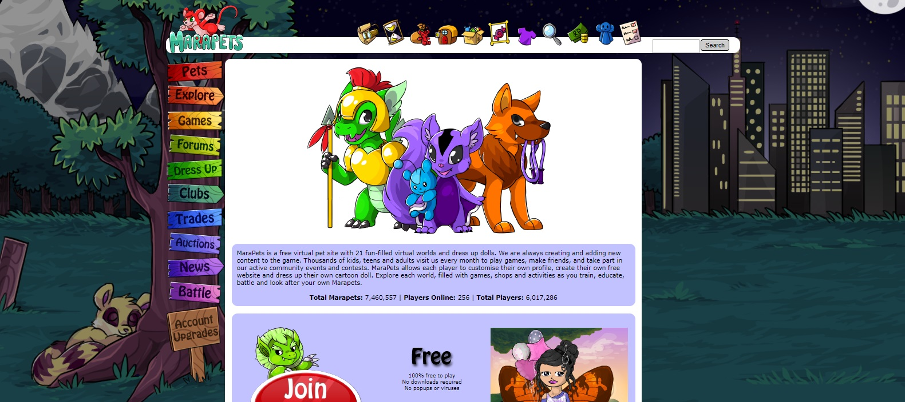

## What is marapets?

Marapets is one of those childhood hobbies I spent majority of my time with after school. It is basically a free virtual pet site with virtual worlds and characters. You can spend (well, my young self) nearly hours trying to develop and maintain your status in the game by completing goals, customizing your character, enhancing your pets' skills, etc.

## Why did I spend my time here?

There is a part of the game where players can join or even create their own "clubs". Its a way to form a community and interact online with other players. I've joined many clubs during the time I played marapets and within those, I experienced many types of leadership, ways of conducting the club, and themes. The problem I came across was: "How can I become someone less ordinary within a club?" That is how I started to delve into the world of programming using the HTML and CSS programming languages to create "club layouts" for specific club website themes. 

## Conclusion

Many people enter programming for other reasons but for me, it was because of a virtual pet game! I have never met anyone else who experienced programming for the first time that was similar to me. And all I can say is that I am thankful for those hours I spent programming "club layouts" for other users because it allowed me to experience the difficulties but extremely rewarding aspects of programming.
