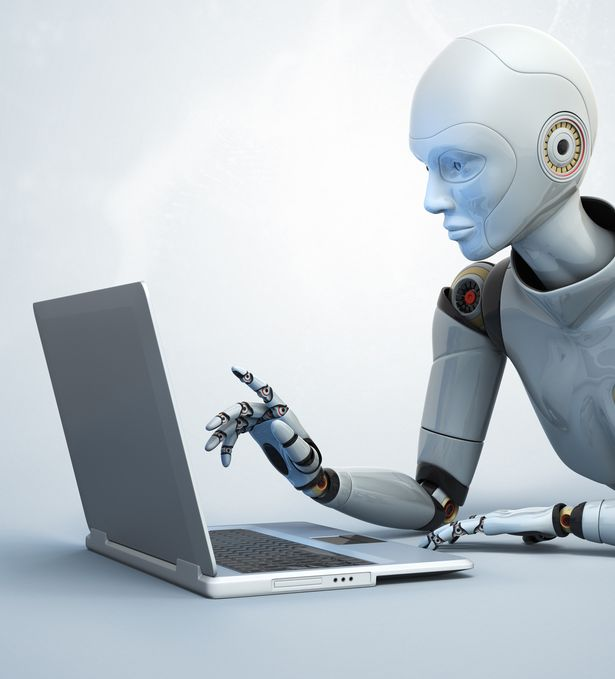

## What are software engineering ethics?

In my opinion, I think ethics regarding software engineering is extremely important. Code that a programmer generates is a small representation of that programmer's ethical standards. Integrity, respect, and honesty are three synonymous words but they all fall under what it means to be ethically competent. A programmer without ethics is one who is just doing the job, no matter what it is and who it will effect. I call this type of programmer a robot. What a dangerous analogy, but I believe it to be true. For one, robots do not possess the ability to reason, sympathize, rationalize, and make complex moral decisions like humans. This reason alone makes humans unique from all other species on Earth. Software are very powerful and can affect many people, whether good or bad. Programmers may just be behind a computer but writing code is more than just using the correct algorithms/problem-solving methods to fulfill a task. Instead, it is more like a civil duty to oneself and to others because of how powerful this type of platform can be.

## Ethical Scenario

An example of this civil duty is portrayed in the scenario below found in freeCodeCamp.org:

> Pretend you are a software developer for an interactive marketing firm. Most of this firm's clients are large pharmaceutical companies who request websites to be made that focuses on their different prescription drugs. One day, you were assigned in a project where you had to build a general information website that involved a drug that targets women, more specifically, teenage girls. The project specifications say that you need to create a quiz that would recommend a type of drug based on the user's answers but the results will only recommend the client's drug except if the user says she/he is already taking it or if she/he is allergic to the drug. You did not think much of the requirements and just simply did the project as is. You later find out that the drug you "advertised" on the website that you had built caused a young girl to take her own life. From this, you also found out that the same drug had some major side effects that include severe depression and suicidal thoughts. The same day, the client invited you and your team to a company dinner to celebrate the completed project. You decide to go regardless of what you had found out. Days after, you resigned from the company you worked for because of the shame you felt for yourself for taking part on that project.

## Reflecting On This Ethical Scenario

I have not been in a situation like this but I can easily reflect on what ethical standards were violated and what could have been done differently on the software developer's part.
Integrity: The programmer did not have integrity towards his work. I feel that each programmer should have integrity towards their own work and be proud of it but it is not the case in this scenario. The software developer had only found out about the drug's side effects after the project was completed and submitted. He then subsequently willingly accepted the client's invitation to dinner with his project team. I feel to prevent this violation of integrity, the programmer should have done a little research on what the drug was about. Although it is not part of the job, it can prevent these types of ethical violations. Also, the programmer should not have attended the dinner because his attendance is a symbol of his acceptance of the situation (but clearly he was bothered).
Respect: The programmer did not have respect for the community and to himself. According to the article in which I based this scenario from, the author writes "As developers, we are often one of the last lines of defense against potentially dangerous and unethical practices." By violating this ethical principle and attending the company dinner, the programmer lacked respect.
Honesty: The programmer was not being entirely honest to the community that the website was for. First of all, the website was supposed to be a general information site, not an advertisement site. Second, the quiz directed the users to only one drug (the client's drug) regardless of their ansers, with a few exceptions. These two reasons alone are examples of dishonesty.

## Conclusion

Programmers are equipped with their own set of ethics. I believe it is what makes a programmer unique because that is what drives them to pursue different projects. In the above scenario, the programmer's actions were unethical but he did maintain a level of integrity when he resigned from his job after the fact. The programmer's actions at first were similar to a robot typing code; the programmer did not think much of the project's requirements and simply "did the job" for the sole purpose of just completing it. This caused ethical violations and left the programmer feeling ashamed. As a programmer, I do believe that we hold a powerful tool and knowledge that could negatively/positively affect a group of people so it is crucial that programmers learn to incorporate professional ethics into their work.

