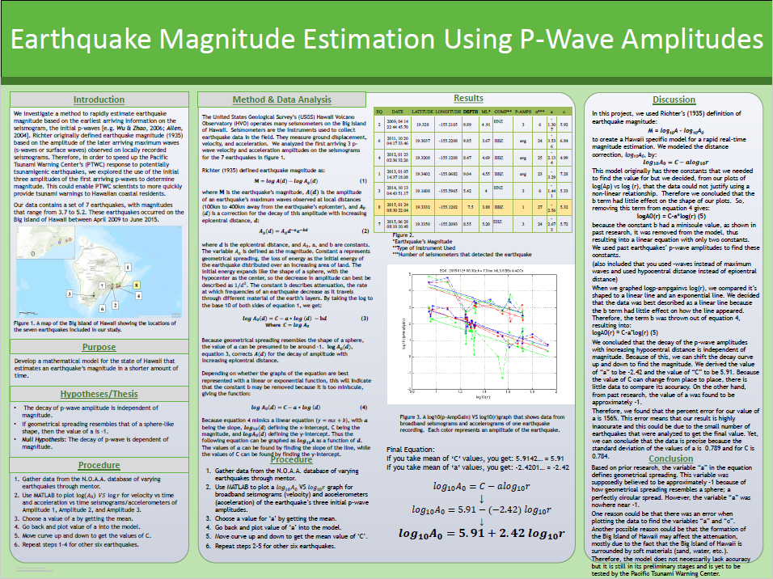
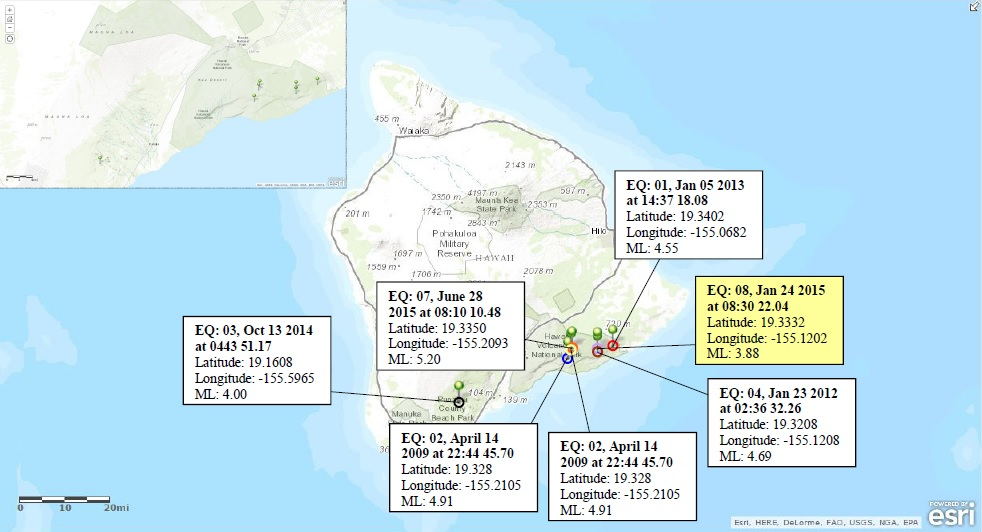

  
  

'Earthquake Magnitude Estimation Using P-Wave Amplitudes' is the headline of my STEM research project during my senior year of high school. I decided to "double-dip" by also entering the project into my high school's science fair. In turn, it advanced to the Leeward district science fair at Leeward Community College and progresssed to the 2016 state science fair at Hawaii Convention Center - Honolulu, HI. The project was awarded 3rd place in the high school fair and won numerous awards in both the leeward and state fairs. The research is focused on investigating a method to rapidly estimate an earthquake's magnitude in order to give the Pacific Tsunami Warning Center (PTWC) 10-20 seconds more time to inform the public of an upcoming tsunami—if the earthquake at hand is strong enough to actually develop a tsunami. Richter's definition for earthquake magnitude was used but was modified in this project so that the earliest arriving information on the seismogram, the initial p-waves, were analyzed instead of the later arriving maximum waves (s-waves or surface waves) of an earthquake. To do this, the project focused on examining recent earthquakes that occurred in Hawaii (the Big Island). The final result was a general equation for earthquake magnitude estimation.

Initially, I wanted to focus my research project on the subject of track and field and the body mechanics required for best performance in athletes during the long jump and triple jump events. I was interested in this area because I was, at the time, an athlete who participated in my school's track and field team. Two of the events that I did were the jumping events mentions above. Thus, I thought that if I could apply what I learn from this research project into my own performance outside on the field, I could see drastic improvement in my jumping form and overall performance. This whole idea was very interesting but I was sidetracked when I was offered the opportunity to enter a different field of research—Earthquakes. Before conducting the research for the project, I did not have any prior knowledge about earthquakes or geophysics at all. But after evaluating the overall scope of the project and its possible impact on the people living in Hawaii, it was a much better opportunity for professional, scientific, and educational advancement. 

The beginning was definitely a big learning curve when it came to starting the research and finishing developing the overall product.  I worked with a fellow classmate along with three mentors: a high school physics teacher, an adviser, and an employee of the Pacific Tsunami Warning Center (PTWC) in Oahu. There were approximately 20.5 hours worth of meetings that were put into this project. In addition to those hours, I was responsible for doing background research on earthquakes, previous methods used by other seismologists, and the Richter Scale. After collecting the data from seven earthquakes that occured recently, with the help of my mentors, we analyzed the graphs and formulated the final outcome of the project. I also worked with my classmate to create the poster board that displayed the overall product of the research project. On my own, I was responsible for maintaining journals that summarized and explained my thoughts in every meeting I had with my mentors. I also worked together with my partner to create the lab report that documented all of the initial hypothesis, procedures, methods, data, data anyalysis, and conclusion of the project.

Completing this project allowed me to explore the realm of scientific research and gave me a taste of what real scientists go through. One of the most important lessons that I had learned is that interpretation is more important than remembering. With interpretation, I was able to relate what I learned from my mentor and the scientific journals that I had read to other concepts that were covered. For this reason, I developed a new love for scientific research. Because of the specific area of study in the Earth and Environmental Sciences field, I learned a lot about earthquakes. There are many things that go into this one study alone such as the different faults that create an earthquake, the types of waves they emit, how its magnitude is measured, the energy distribution of an earthquake, and etc. It made me understand how wide the span of scientific research can go and the never ending limits of discovery it can lead to.

